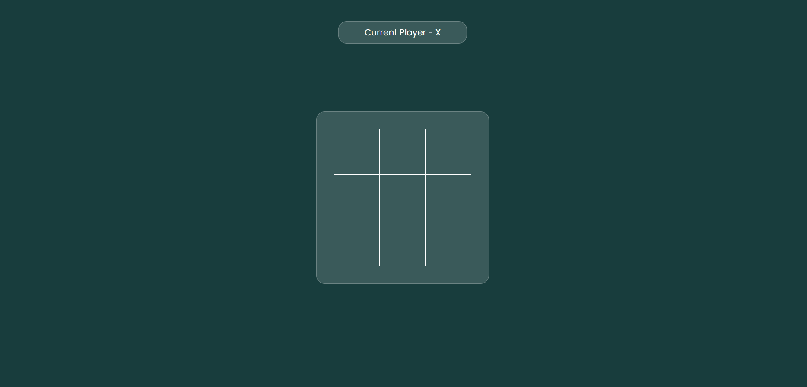

# Tic Tac Toe Game

This is a simple web-based Tic Tac Toe game implemented using HTML, CSS, and JavaScript.

## How to Play

1. Open the `index.html` file in a web browser.

2. You can play the game with two players, taking turns to make your moves.

3. Click on an empty cell in the Tic Tac Toe grid to place your mark (X or O).

4. The game will automatically detect a win, draw, or continue until one player wins or the board is full.

5. To start a new game, click the "New Game" button.

## Technologies Used

- HTML
- CSS
- JavaScript

## Credits

Fonts used in the project are from [Google Fonts](https://fonts.google.com/).

## License

This project is licensed under the MIT License. See the [LICENSE](LICENSE) file for details.
